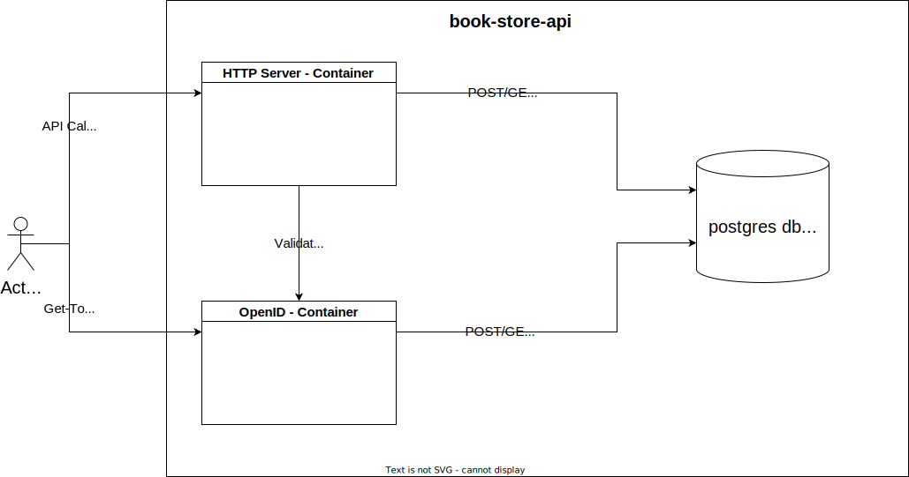

# Book-Store
The project is used as playground with REST-API and BackendDB Interaction written in Golang

## Description
- Providing authentication with OpenID Container to secure the REST-API
- Providing basic CRUD Endpoints for the book-store

## Visual Infrastructure

## Getting Started
### Dependencies
- Golang
- Docker

### Installing
- None

### Executing program
- None

## Help
- None

## Authors
@derchrischkya

